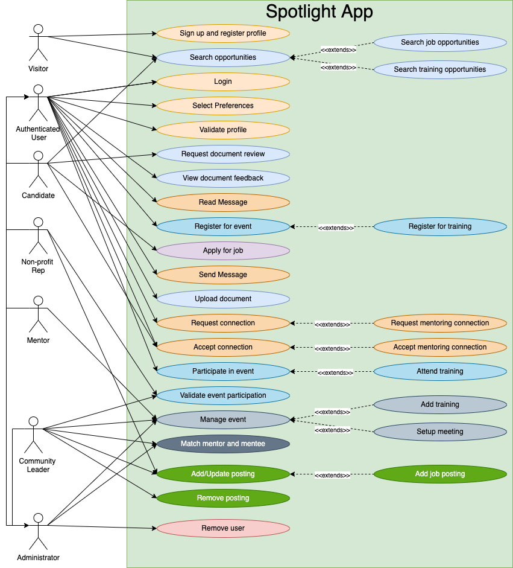

# ArchKataSpring2022
O'Reilly Spring 2022 Architectural Kata design documents.

Team: Archikers
* Brian Liu
* Keshwan Ramlu
* David Robinson
* Prafull Surana
* Mikhael Vasilkovsky

## Overview

This repository contains all documentation related to the architectural design of the Spotlight application for the Diversity Cyber Council. For information regarding the contents and organization of this documentation please refer to the FAQ at the end of this document.

The [requirements document](kata_initial_documentation/DiversityCyberCouncilKataRequirements2022.pdf) provides the intial requirements as given by the Diversity Cyber Council.

**NOTE: This repository is best consumed within the GitHub UI.**

## Exexutive Summary

>"The Spotlight App Project is a sustained effort to amass a coalition of
nonprofits in order to address specific needs within the communities we serve by leveraging a
centralized platform as the base of operations to collaborate and make a collective impact."

* Archikers proposes to build and deliver flexible, maintainable, scalable and extensible platform to
    * Provide centralized avenue for Non-profits to deliver services
    * Promote collaboration among Non-profits as well as between Non-profits & candidates
    * Increase visibility and accessibility of services to aspiring candidates 
    * Provide capability to raise any issues related to service and getting the resolution
* Proposed solution is going to be secure, highly available and cost-effective meeting Non-profit current and future operational need

## Requirement Understanding

## High level Use cases

## Business and Architecture Principles

The following principles will drive the Spotlight Platform architecture and build.
### Business Principle
* **Build matching decision based on user preference, Not demand-supply** -
To recommend matching, System will higher weighatge to user preference and Non-profit service offering attributes than ratinga & demand-supply 
* **Collaboration is the key** -  
System will promote higher level of collaboration among system users (Non-Profits, Candidates and Administrators)
* **Turn Data into actionable Insight** - 
Every data attributes, use action, and interaction will be captured by system and will be used to generate insight. Which will promote better pridiction, matching and visibility
* **Ease of use** -
System will be easy to use by different persona's on different devices
### Architecture Principle 
* **Microservice architecture** - 
System will be loosely coupled, extensible, scalable and easily maintainable. Microservice Architecuture will be followed
* **12 Factor App principle** -
System will be built using 12 factor app principle
* **Responsive Web Design (RWD)** - 
User interface will be built using RWD principle allowing it to be render in different devices like desktop, tablet, mobile
* **Design for flexibility and Self Service** - 
Platform will be flexible to extend and enhance the functionality. It will be developed such a way that user can use it with minimal support and collaborate among themselves to resolve any queries. This will eventually have less operational cost to run the platform    
* **Enterprise & Data Security** -
All technologies, solutions, tools, designs, applications, and methods used within the architecture must adhere to all security and privacy policies, procedures, guidelines, and standards. This will ensure that there is no security breaches and no financial liability to the company. Data will be accessible to authorized user 
* **Cloud first approach** - 
Platform will be cloud native and most of the components will be built and deployed on serverless platform. This will help to reduce the capital cost as well as provide inherent high availability, scalability, and extensibility. 

## Conceptual Architecture

## Solution Architecture

## Technology Stack/Choices

## Architecture Decisions (ADRs)
All ADRs may be referenced at [ADRs](architecture_decision_records).

## DevSecOps

## Non-Functional Requirement mapping

## Assumptions and constraints

## FAQ

**Q: I want to contribute to this documentation. What tools are reuired to create documents?**

A: The short answer is that you will need some knowledge of markdown for text  and diagram.net for diagrams. Documentation guidleines are found in the [DocumentationGuidelines](documentation_guidelines) directory in this repo.

